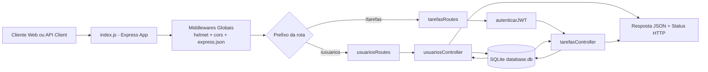
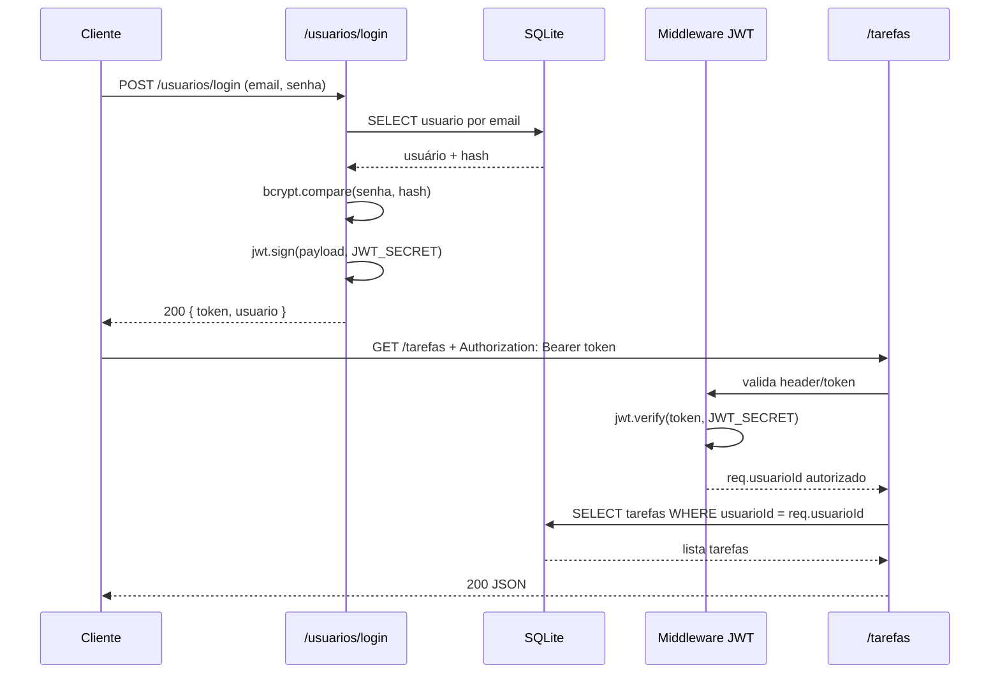
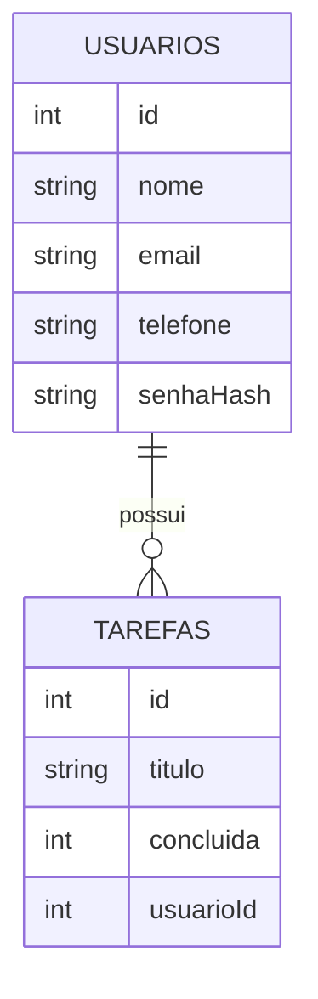

# Explicação Técnica do Projeto `projeto-senac-back`

## 1. Visão geral

Este projeto é uma API REST didática construída com **Node.js + Express + SQLite**, focada em:

- CRUD de usuários
- CRUD de tarefas
- autenticação com JWT
- boas práticas básicas de segurança web

A aplicação segue uma arquitetura simples em camadas:

- **Entrada da aplicação**: `index.js`
- **Rotas HTTP**: `src/routes`
- **Regras de negócio**: `src/controllers`
- **Autenticação (middleware)**: `src/middlewares`
- **Persistência e schema**: `src/data/db.js`

---

## 2. Linguagem e tecnologias

### Linguagem

- **JavaScript (ES Modules)**
- O projeto usa `"type": "module"` no `package.json`, então os imports são feitos com `import`/`export`.

### Bibliotecas principais

- `express`: servidor HTTP e roteamento
- `sqlite` + `sqlite3`: banco de dados em arquivo com API assíncrona
- `bcrypt`: hash seguro de senha
- `jsonwebtoken`: criação e validação de token JWT
- `helmet`: headers de segurança HTTP
- `cors`: controle de origem para chamadas do frontend
- `dotenv`: carregamento de variáveis de ambiente
- `nodemon` (dev): reload automático

---

## 3. Como a execução acontece

## 3.1 Bootstrap da aplicação

Quando você executa `npm start` ou `npm run dev`, o Node inicia `index.js`:

1. Carrega variáveis de ambiente com `import 'dotenv/config'`
2. Cria o app Express
3. Registra middlewares globais:
   - `helmet()`
   - `cors(...)`
   - `express.json()`
4. Monta rotas:
   - `/usuarios`
   - `/tarefas`
5. Sobe o servidor na porta `process.env.PORT || 3000`

## 3.2 Banco de dados

A conexão com SQLite é aberta sob demanda em `getDatabase()` (`src/data/db.js`) e mantida como singleton.

Na primeira chamada:

- abre/gera `src/data/database.db`
- ativa `PRAGMA foreign_keys = ON`
- cria tabelas se não existirem:
  - `usuarios`
  - `tarefas` (com FK para `usuarios` e `ON DELETE CASCADE`)

---

## 4. Fluxo de uma requisição

1. Requisição chega no Express
2. Passa pelos middlewares globais (`helmet`, `cors`, parser JSON)
3. Entra na rota (`routes/...`)
4. Se rota protegida: passa no middleware `autenticarJWT`
5. Controller executa regra de negócio + SQL
6. Controller retorna JSON com status adequado

---

## 5. Autenticação e autorização

## 5.1 Login

No `POST /usuarios/login`:

1. Busca usuário por e-mail
2. Compara senha digitada com hash salvo (`bcrypt.compare`)
3. Gera token JWT com payload `{ usuarioId, nome }`
4. Retorna `{ token, usuario }`

## 5.2 Validação do token

O middleware `src/middlewares/autenticacao.js`:

- lê header `Authorization: Bearer <token>`
- valida token com `jwt.verify(token, process.env.JWT_SECRET)`
- coloca `req.usuarioId` e `req.usuarioNome`
- se inválido/expirado: `401`

## 5.3 Regras de autorização

- Usuário só pode **editar/remover o próprio usuário** (`usuariosController`)
- Usuário só pode **ver/editar/remover as próprias tarefas** (`tarefasController`)
- Em tarefas, o `usuarioId` usado para filtros vem do token, não do body

---

## 6. Segurança aplicada no projeto

## 6.1 Itens implementados

- Senha armazenada com hash (`bcrypt`), nunca em texto puro nas respostas
- Uso de prepared statements (`?`) nas queries SQL
- JWT com validade (`JWT_EXPIRES_IN`) e assinatura (`JWT_SECRET`)
- `helmet` para headers de segurança
- CORS com lista explícita de origens e `credentials: true`
- Mensagem genérica no login inválido (`Credenciais inválidas`)

## 6.2 CORS atual

No estado atual do código, as origens permitidas são:

- `http://127.0.0.1:5500`
- `http://localhost:5500`
- `http://localhost:8080`
- `http://127.0.0.1:8080`

Com `credentials: true`, o navegador pode enviar cookies/credenciais em requisições cross-origin permitidas.

## 6.3 Pontos de atenção

- Não há rate limiting (proteção contra brute force e abuso)
- Não há refresh token/revogação de JWT
- `GET /usuarios` está público na implementação atual (ver seção de endpoints)
- Há arquivo `scripts.sql` com senhas em texto puro para seed didático; isso não deve ser usado em produção

---

## 7. Endpoints e comportamento real

## 7.1 Usuários

- `POST /usuarios` (público): cria usuário
- `POST /usuarios/login` (público): autentica e retorna JWT
- `GET /usuarios/perfil` (protegido): retorna dados do usuário do token
- `GET /usuarios` (**público no código atual**): lista usuários sem senha
- `GET /usuarios/:id` (protegido)
- `PUT /usuarios/:id` (protegido, só o próprio)
- `DELETE /usuarios/:id` (protegido, só o próprio)

## 7.2 Tarefas (todas protegidas)

- `GET /tarefas`
- `GET /tarefas/usuario/:usuarioId` (só do próprio usuário)
- `GET /tarefas/:id` (apenas se a tarefa for do usuário logado)
- `POST /tarefas`
- `PUT /tarefas/:id`
- `DELETE /tarefas/:id`

---

## 8. Modelo de dados

- `usuarios`
  - `id` (PK)
  - `nome`
  - `email` (UNIQUE)
  - `telefone`
  - `senha` (hash)
- `tarefas`
  - `id` (PK)
  - `titulo`
  - `concluida` (0/1 no banco; boolean no JSON)
  - `usuarioId` (FK -> `usuarios.id`)

Quando um usuário é removido, suas tarefas são removidas automaticamente (`ON DELETE CASCADE`).

---

## 9. Códigos de status mais usados

- `200`: sucesso geral (GET/PUT/DELETE)
- `201`: criado com sucesso (POST)
- `400`: dados inválidos ou ausentes
- `401`: não autenticado / token inválido
- `403`: sem permissão para recurso de outro usuário
- `404`: recurso não encontrado
- `409`: conflito (ex.: e-mail duplicado)
- `500`: erro interno inesperado

---

## 10. Diagramas Mermaid

### 10.1 Arquitetura e fluxo macro

### 10.2 Sequência de autenticação (login + rota protegida)

### 10.3 Modelo entidade-relacionamento

---

## 11. Melhorias recomendadas para evolução

1. Proteger `GET /usuarios` com `autenticarJWT` para manter consistência com as demais rotas de usuário.
2. Adicionar validação robusta com `zod` ou `joi`.
3. Implementar rate limiting (`express-rate-limit`) especialmente no login.
4. Padronizar tratamento de erros com middleware central e códigos de erro internos.
5. Criar testes automatizados (integração para rotas e unidade para controllers).
6. Adicionar logs estruturados e correlação de requisições.

---

## 12. Resumo final

O projeto foi construído como uma API REST educacional, com separação de responsabilidades clara, autenticação JWT, persistência em SQLite e medidas essenciais de segurança. O fluxo principal é: rota -> middleware (quando necessário) -> controller -> banco -> resposta JSON. A base está boa para ensino e para pequenos cenários, com espaço para evoluções de segurança e observabilidade para produção.
